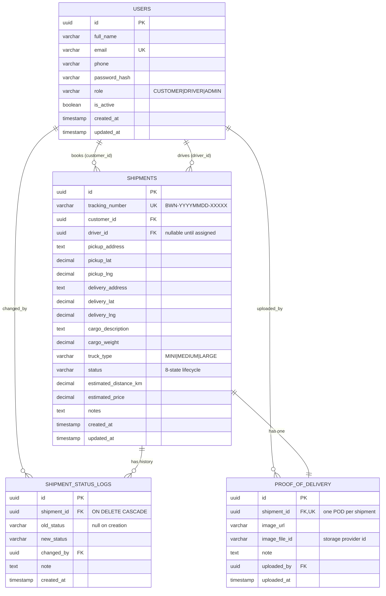

# Bowmenn API — Freight Logistics MVP (Backend)

The backend for **Bowmenn**, a freight logistics platform that takes a shipment from
**booking → assignment → delivery → proof of delivery**.

Bowmenn connects shippers (customers) with truck drivers. Customers book and track
shipments; admins assign drivers and oversee operations; drivers accept work, move a
shipment through its lifecycle, and upload photographic proof of delivery.

> This is the **API** repository. The web client lives in a separate repo —
> [**bowmenn-frontend**](https://github.com/adamufura/bowmenn-frontend).

| | |
|---|---|
| **Stack** | Java 21 · Spring Boot 3.5 · PostgreSQL · Flyway · Spring Security (JWT) |
| **Live API** | https://furacomp-products-bowmenn-api.o9oxxq.easypanel.host |
| **API docs (Swagger)** | https://furacomp-products-bowmenn-api.o9oxxq.easypanel.host/swagger-ui.html |
| **Live app** | https://furacomp-products-bowmenn-frontend.o9oxxq.easypanel.host |
| **Frontend repo** | https://github.com/adamufura/bowmenn-frontend |

**Demo admin:** `admin@bowmenn.com` / `Admin@123` — register your own `CUSTOMER` / `DRIVER` from the app.

---

## Table of contents

1. [Project overview](#project-overview)
2. [Quick start](#quick-start)
3. [Architecture](#architecture)
4. [Technology choices](#technology-choices)
5. [Database schema](#database-schema)
6. [API reference](#api-reference)
7. [Features implemented](#features-implemented)
8. [Intentionally excluded from the MVP](#intentionally-excluded-from-the-mvp)
9. [Future improvements](#future-improvements)
10. [Testing](#testing)
11. [Security notes](#security-notes)
12. [Configuration](#configuration)

---

## Project overview

Three roles share one system:

- **Customer** — registers, books a shipment (pickup/delivery, cargo, weight, truck type),
  gets a live price estimate, tracks status, and views proof of delivery.
- **Driver** — sees assigned shipments, accepts or rejects them, advances status
  (`Picked Up → In Transit → Delivered`), and uploads proof of delivery.
- **Admin** — views all shipments, assigns drivers, manages users, updates status where
  necessary, and reviews completed deliveries.

The design goal was a **thin but complete** path from booking to delivery, built on a
foundation that scales — not a broad, half-working feature surface.

---

## Quick start

**Prerequisites:** JDK 21 and a running PostgreSQL 13+ instance.

```bash
# 1. Create the database
createdb bowmenn        # or: psql -U postgres -c "CREATE DATABASE bowmenn;"

# 2. Run (from this directory)
./mvnw spring-boot:run
```

On first boot Flyway creates the schema (`V1`–`V6`) and seeds the admin user. **No
third-party credentials are required** — file storage defaults to the local disk.

- API: http://localhost:8080
- Swagger UI: http://localhost:8080/swagger-ui.html
- OpenAPI JSON: http://localhost:8080/api-docs

Package a jar: `./mvnw clean package` → `target/bowmenn-api-0.0.1-SNAPSHOT.jar`.
A `Dockerfile` is included for containerised deploys.

---

## Architecture

### Overall shape

A **modular monolith** backend serving a **SPA** frontend over a stateless JSON API.

```
┌──────────────────────┐         ┌───────────────────────────────────────┐
│  React SPA           │  JWT    │  Spring Boot API                      │
│  (Vite, TS)          │ ──────► │                                       │
│                      │  JSON   │  ┌─────────────────────────────────┐  │
│  • Zustand (auth)    │ ◄────── │  │ modules/  auth · user · shipment│  │
│  • TanStack Query    │         │  │           driver · admin · pod  │  │
│  • React Router      │         │  │           pricing               │  │
└──────────────────────┘         │  ├─────────────────────────────────┤  │
                                 │  │ common/   security · storage    │  │
                                 │  │           exception · config    │  │
                                 │  └─────────────────────────────────┘  │
                                 └────────────┬──────────────┬───────────┘
                                              │              │
                                       ┌──────▼─────┐  ┌─────▼───────────┐
                                       │ PostgreSQL │  │ File storage    │
                                       │  (Flyway)  │  │ local ⇄ ImageKit│
                                       └────────────┘  └─────────────────┘
```

### Why a modular monolith

At MVP scale, microservices would buy distributed-systems problems (network partitions,
eventual consistency, deploy orchestration) in exchange for organisational benefits a
single team doesn't yet need. Instead the backend is organised **by domain module, not by
layer** — each module owns its controllers, services, repositories, DTOs, and entities:

```
com.bowmenn.bowmenn_api
├── common/           cross-cutting concerns
│   ├── config/       SecurityConfig, CorsConfig, OpenApiConfig, WebConfig
│   ├── exception/    GlobalExceptionHandler + typed exceptions
│   ├── response/     ApiResponse<T> envelope
│   ├── security/     JwtService, JwtAuthFilter, UserDetailsServiceImpl
│   ├── storage/      FileStorageService (local / ImageKit implementations)
│   └── util/         PricingUtil (haversine, pricing, tracking numbers)
└── modules/
    ├── auth/         register · login · me
    ├── user/         User entity, roles, repository
    ├── shipment/     Shipment, status state machine, audit log
    ├── driver/       driver-facing shipment actions
    ├── admin/        assignment, user management, stats
    ├── pod/          proof-of-delivery
    └── pricing/      public price estimation
```

Each module is a seam. If `pod` or `pricing` ever needs to scale independently, it can be
lifted out without unpicking a layered spaghetti of `services/` and `repositories/`.

### Key design decisions

**The status lifecycle is a state machine, enforced server-side.** Illegal transitions are
rejected with `400` regardless of which client or role attempts them:

```
PENDING ──► ASSIGNED ──► ACCEPTED ──► PICKED_UP ──► IN_TRANSIT ──► DELIVERED
   │            │            │
   │            │            └──► CANCELLED
   │            ├──► REJECTED
   │            └──► CANCELLED
   └──► CANCELLED
```

The rule lives in one place — `ShipmentStatus.canTransitionTo` — rather than being
re-implemented per controller. The frontend mirrors it only to decide which buttons to
show; the server remains the source of truth.

**Two layers of authorisation.** URL-prefix rules decide which *role* may call an endpoint;
object-level checks then decide which *rows* that user may touch. A shipment is visible only
to the customer who booked it, its assigned driver, and admins; only the assigned driver (or
an admin) may advance its status or upload proof of delivery. This closes the IDOR class of
bugs that role checks alone leave open.

**Every status change is audited.** `shipment_status_logs` is an append-only record of who
changed what, when, and why. Disputes over "when was it picked up?" are answerable.

**Storage is behind an interface.** `FileStorageService` has a local-disk implementation
(the default, so the repo runs after a clone with zero credentials) and an ImageKit
implementation for production, selected by `storage.provider`. Swapping in S3 is a new
class, not a refactor.

**The schema is owned by Flyway, not Hibernate.** `ddl-auto=validate` means the app refuses
to start if the entities and the migrated schema disagree — migrations are reviewable,
versioned, and reproducible.

**One response envelope.** Every endpoint returns `{ status, message, data }`, and a
`@RestControllerAdvice` maps exceptions to it, so the client has exactly one error path.

---

## Technology choices

| Choice | Why | Trade-off accepted |
|---|---|---|
| **Spring Boot 3.5 / Java 21** | Mature ecosystem for transactional business software; first-class security, validation, migrations. Records and pattern-matching switches keep the domain code terse. | More ceremony than Node/Express; slower cold start. |
| **PostgreSQL** | Relational data with real integrity requirements (a shipment *must* have a customer; a POD *must* map to exactly one shipment). Constraints and transactions do work we'd otherwise hand-code. `CHECK` constraints mirror the enums. | — |
| **Flyway** | Versioned, ordered, reviewable schema changes. Paired with `ddl-auto=validate`, drift between code and database becomes a startup failure instead of a production incident. | Must add a migration rather than edit an entity. |
| **Stateless JWT** | Horizontally scalable with no shared session store; the natural fit for an SPA plus a future mobile driver app. | Tokens can't be revoked before expiry — see [Future improvements](#future-improvements). |
| **Spring Security + BCrypt** | Battle-tested auth primitives; no hand-rolled crypto. | — |
| **springdoc-openapi** | Swagger UI generated from the controllers — living, always-accurate API docs. | — |

---

## Database schema

Four tables. `users` is a **single table with a `role` discriminator** rather than separate
`customers`/`drivers`/`admins` tables — the entities differ only by role today, and a
premature split would mean a painful merge the moment a person is both.



**Notes**
- **UUID primary keys** — shipment/user ids appear in URLs; sequential integers would leak
  business volume and invite enumeration.
- **Indexes** on `users(email, role)` and `shipments(customer_id, driver_id, status, tracking_number)`
  cover every read path in the app.
- **`CHECK` constraints** on `role`, `truck_type`, and `status` keep the database honest even
  if a bad write bypasses the application.
- **`proof_of_delivery.shipment_id` is `UNIQUE`** — "one POD per shipment" is a database
  constraint, not just application logic.

Migrations live in [`src/main/resources/db/migration`](src/main/resources/db/migration) (`V1`–`V6`).
A standalone ER diagram (with relationship and design notes) is in
[`docs/ER-diagram.md`](docs/ER-diagram.md).

---

## API reference

All responses use the envelope `{ status, message, data }`. Auth is a Bearer JWT.
Full, interactive reference: **Swagger UI** (link above) or [`docs/API.md`](docs/API.md).

| Method | Path | Role | Purpose |
|---|---|---|---|
| POST | `/api/auth/register` | public | Register a CUSTOMER or DRIVER |
| POST | `/api/auth/login` | public | Log in, receive JWT |
| GET | `/api/auth/me` | any | Current user |
| POST | `/api/shipments` | CUSTOMER | Book a shipment |
| GET | `/api/shipments/my` | CUSTOMER | My shipments |
| GET | `/api/shipments/{id}` | owner/driver/admin | Shipment detail |
| GET | `/api/shipments/track/{trackingNumber}` | participant | Track by number |
| GET | `/api/pricing/estimate` | public | Distance + price estimate |
| GET | `/api/driver/shipments` | DRIVER | Assigned shipments |
| PUT | `/api/driver/shipments/{id}/accept` · `/reject` | DRIVER | Accept / reject |
| PUT | `/api/driver/shipments/{id}/status` | DRIVER | Advance status |
| GET | `/api/admin/shipments` | ADMIN | All shipments |
| PUT | `/api/admin/shipments/{id}/assign` | ADMIN | Assign a driver |
| PUT | `/api/admin/shipments/{id}/status` | ADMIN | Update status |
| GET | `/api/admin/drivers` · `/customers` · `/stats` | ADMIN | Directories & stats |
| PUT | `/api/admin/users/{id}/toggle-status` | ADMIN | Activate / deactivate |
| POST | `/api/pod/{shipmentId}` | assigned driver | Upload proof of delivery |
| GET | `/api/pod/{shipmentId}` | participant | Retrieve POD |

---

## Features implemented

**Customer** — register/login; book a shipment (addresses + optional coordinates, cargo,
weight, truck type, notes); **live price estimate** before booking; view all shipments;
shipment detail with progress stepper; driver details once assigned; **view proof of delivery**.

**Driver** — login; dashboard stats; view assigned shipments; **accept / reject**; advance
`Picked Up → In Transit → Delivered`; **upload proof of delivery** (photo + note).

**Admin** — stats (total shipments, drivers, customers, pending, delivered); view **all
shipments** filterable by *Pending / In Progress / Completed / Cancelled*; **assign a driver**
to a pending shipment; **update status** where necessary; view drivers & customers;
**activate / deactivate** users (deactivated users can't log in).

**Cross-cutting** — stateless JWT auth, BCrypt hashing, role **and** object-level
authorisation, server-enforced status state machine, append-only audit log, consistent
response envelope, global exception handling, OpenAPI/Swagger docs, pluggable file storage.

---

## Intentionally excluded from the MVP

The brief asks what was left out and why. Each was considered and consciously deferred — the
goal was a *thin, complete* booking-to-delivery path, not a broad, half-working surface.

| Excluded | Why |
|---|---|
| **Payments / invoicing** | The MVP must prove the *operational* loop works before it can meaningfully take money. Payments add PCI scope, refunds, reconciliation, and a provider dependency. Price is already calculated and stored, so invoicing can be layered on without schema change. |
| **Live GPS tracking on a map** | Requires a driver mobile app emitting location, a streaming/geospatial store, and a maps billing account. The discrete status timeline answers the customer's real question ("where is my cargo in the process?") at a fraction of the cost. Coordinates are already captured, so the upgrade path exists. |
| **Real-time push / WebSockets** | Status changes happen minutes-to-hours apart, not seconds. Polling on navigation is sufficient and removes a class of connection-lifecycle bugs. Revisit when drivers stream GPS. |
| **Driver auto-matching / dispatch optimisation** | Optimal assignment needs driver location, capacity, and historical performance — data we won't have until the platform runs. Admin assignment is the honest v1 and produces exactly the training data an algorithm would later need. |
| **Email / SMS notifications** | An external provider (and its credentials, templates, deliverability, retries) for a loop already observable in-app. First integration point after launch. |
| **Refresh tokens / revocation** | A 24-hour access token is an accepted MVP risk. Doing it *properly* means a token store, rotation, and reuse detection — meaningful work that shouldn't be half-done. Called out below. |
| **Fleet / vehicle records** | `TruckType` captures the only fleet attribute pricing and matching currently need. Vehicle registration, maintenance, and documents are a real domain, but not on the critical path. |
| **Ratings & reviews** | Meaningless without delivery volume. |
| **Soft deletes** | Nothing is deleted in the MVP — shipments are cancelled, users are deactivated. |
| **i18n / dark mode** | Single market, single locale; no user has asked. |

---

## Future improvements

**Security & auth (first)**
- Short-lived access tokens + rotating refresh tokens with reuse detection; a denylist so
  deactivating a user invalidates their session immediately (today they keep a valid token
  until it expires).
- Rate limiting on `/api/auth/**` to blunt credential stuffing.

**Correctness & scale**
- Pagination on `GET /api/admin/shipments` and `/api/shipments/my` (currently unbounded
  `findAll` — fine at MVP volume, not at 100k shipments).
- `GET /api/admin/stats` from in-memory counting to `COUNT(*)` aggregate queries.
- Optimistic locking (`@Version`) on `Shipment` so two admins can't assign different drivers
  concurrently; idempotency keys on shipment creation.

**Testing**
- Integration tests with **Testcontainers** (real PostgreSQL) for auth, the status state
  machine, and RBAC — replacing the shell smoke test as the primary gate.
- Unit tests for `PricingUtil` (haversine boundaries, minimum-price floor).

**Product & ops**
- Driver GPS breadcrumbs → live map (coordinates already stored); email/SMS notifications;
  payments + invoicing off the computed `estimated_price`; public tracking page.
- CI (build, test, migration check); structured JSON logging with a correlation id.

---

## Testing

An end-to-end smoke test drives **every endpoint** and asserts status codes and response
bodies — including negative cases (invalid transitions, duplicate email, duplicate POD) and
authorisation (RBAC 403/401 **and** object-level IDOR regressions).

```bash
./mvnw spring-boot:run        # terminal 1
./scripts/smoke-test.sh       # terminal 2  →  "64 passed, 0 failed"
```

It is re-runnable (unique timestamped emails) and reads `BASE_URL` / `ADMIN_EMAIL` /
`ADMIN_PASSWORD` from the environment.

> **Honest gap:** there is no JUnit suite yet. For an MVP under time constraints I prioritised
> one high-confidence test that exercises the real system end to end over a scattering of unit
> tests around mocks. Testcontainers-based integration tests are the first thing I'd add.

---

## Security notes

- Passwords hashed with **BCrypt**; never returned by any endpoint.
- **No credentials are committed.** Storage defaults to local disk so the project runs after
  a clone. For ImageKit, set `STORAGE_PROVIDER=imagekit` + `IMAGEKIT_*` env vars, or create a
  gitignored `bowmenn-local.properties` (auto-loaded via `spring.config.import`).
- `JWT_SECRET` ships with a **development-only default** — override it in any real
  environment. The signing key accepts either a Base64 or a raw string and rejects secrets
  shorter than 256 bits.
- **Object-level authorisation** on every shipment-scoped operation (no IDOR).
- Uploaded filenames are sanitised and path traversal is rejected in the local storage provider.

---

## Configuration

Everything is environment-overridable — see [`.env.example`](.env.example). Key vars:

| Var | Default | Notes |
|---|---|---|
| `SPRING_DATASOURCE_URL` | `jdbc:postgresql://localhost:5432/bowmenn` | JDBC URL |
| `SPRING_DATASOURCE_USERNAME` / `_PASSWORD` | `postgres` / `postgres` | DB creds |
| `JWT_SECRET` | dev default | **override in production** (Base64 or ≥32-char string) |
| `JWT_EXPIRATION` | `86400000` | Token TTL (ms) |
| `STORAGE_PROVIDER` | `local` | `local` or `imagekit` |
| `IMAGEKIT_*` | — | Required only when `STORAGE_PROVIDER=imagekit` |
| `PORT` | `8080` | HTTP port |
