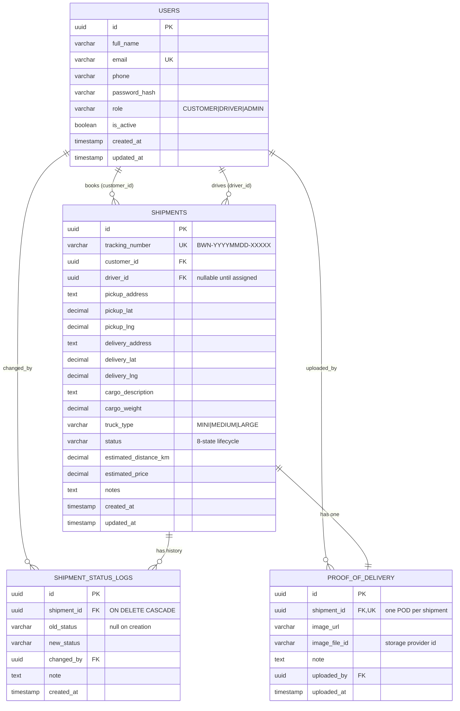

# Bowmenn — Database Schema (ER Diagram)

Four tables model the entire booking→delivery domain. `users` is a single table with a
`role` discriminator (`CUSTOMER | DRIVER | ADMIN`). A shipment references `users` twice —
once as the customer who booked it, once as the driver assigned to it. Status history and
proof of delivery hang off the shipment.

A rendered image is available at [`er-diagram.svg`](er-diagram.svg); the Mermaid source is
in [`er-diagram.mmd`](er-diagram.mmd). The diagram below also renders natively on GitHub.

## Relationships

| From | To | Cardinality | Notes |
|---|---|---|---|
| `users` | `shipments` | 1 customer → many shipments | `shipments.customer_id` (required) |
| `users` | `shipments` | 1 driver → many shipments | `shipments.driver_id` (nullable until assigned) |
| `shipments` | `shipment_status_logs` | 1 → many | append-only audit trail; `ON DELETE CASCADE` |
| `shipments` | `proof_of_delivery` | 1 → 1 | `shipment_id` is `UNIQUE` |
| `users` | `shipment_status_logs` | 1 → many | `changed_by` (who made the change) |
| `users` | `proof_of_delivery` | 1 → many | `uploaded_by` |

## Design notes

- **UUID primary keys** — ids appear in URLs; sequential integers would leak business volume
  and invite enumeration.
- **`CHECK` constraints** on `role`, `truck_type`, and `status` enforce the enums at the
  database level, independent of the application.
- **`proof_of_delivery.shipment_id UNIQUE`** makes "one POD per shipment" a database
  guarantee, not just application logic.
- **Indexes** cover every read path: `users(email, role)` and
  `shipments(customer_id, driver_id, status, tracking_number)`.
- **Single `users` table** rather than per-role tables — the roles differ only by a
  discriminator today, and splitting prematurely would force a painful merge the first time
  one person is both a customer and a driver.

The authoritative schema is the Flyway migration set in
[`../src/main/resources/db/migration`](../src/main/resources/db/migration) (`V1`–`V6`).
